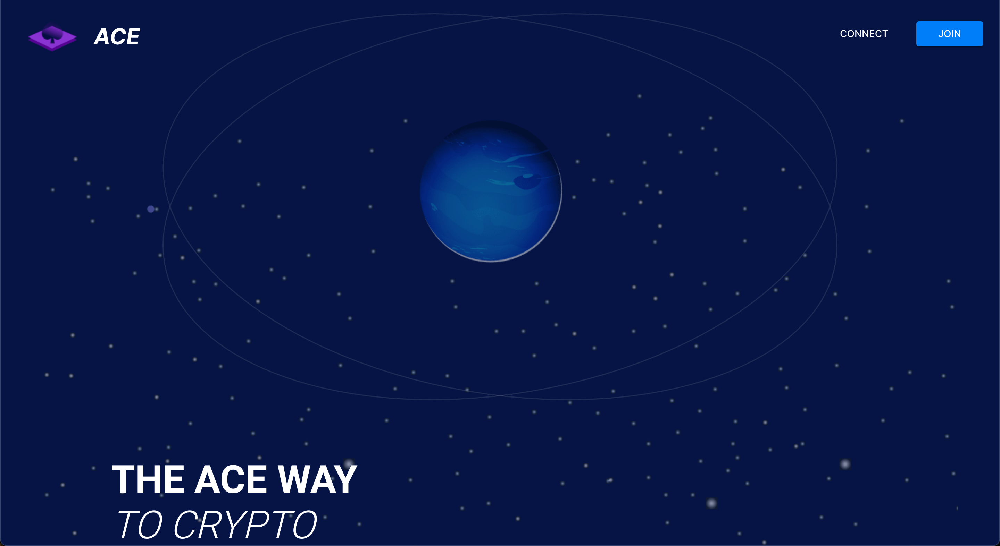
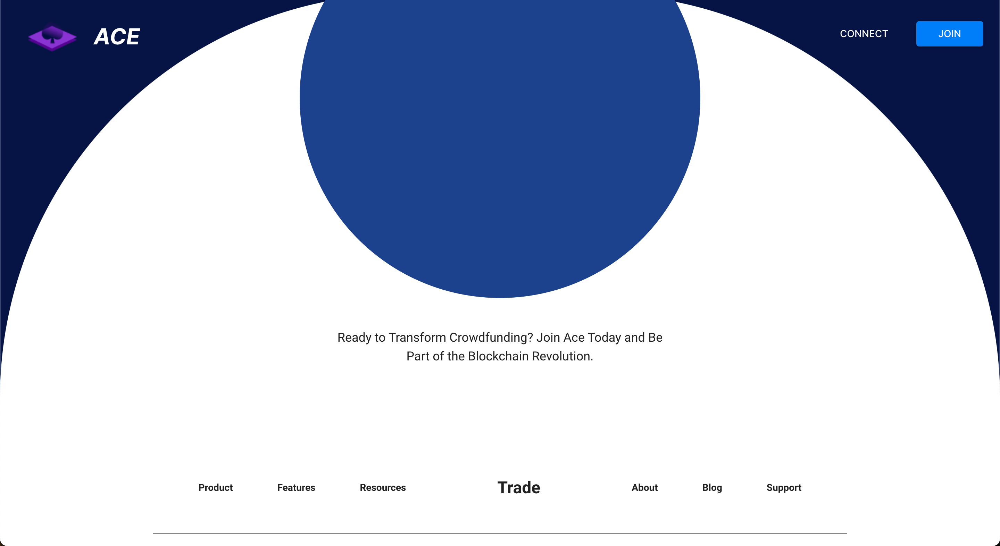
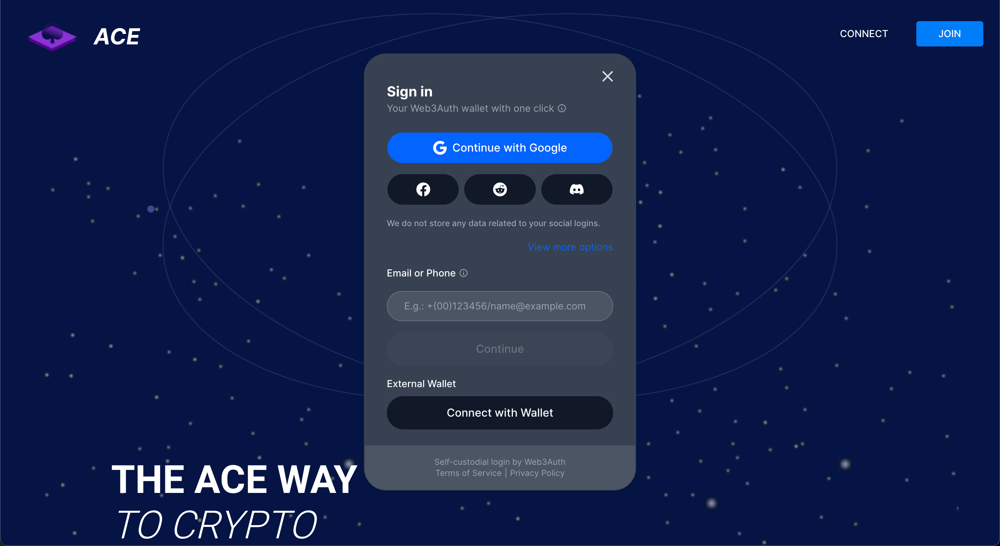
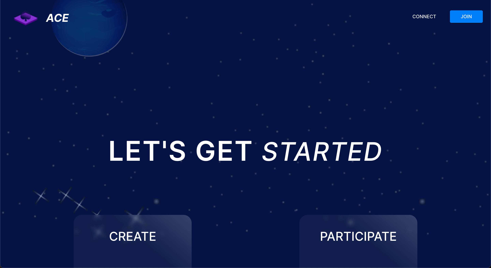
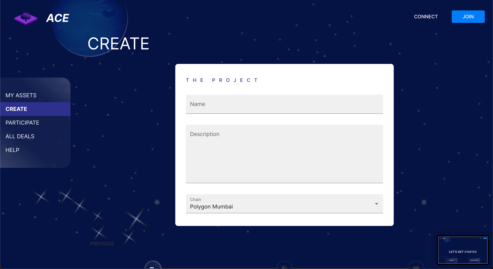
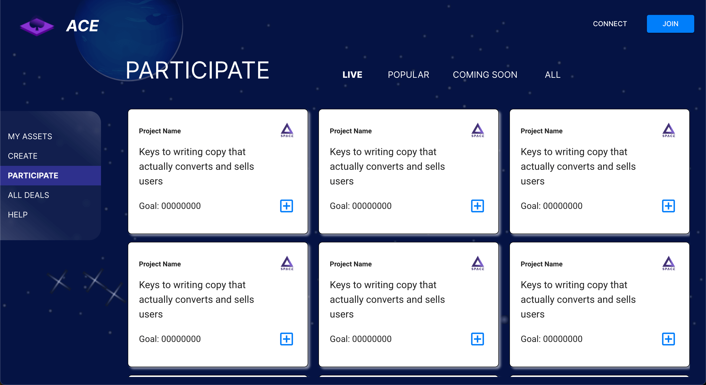

# Chainlink Hackathon 2023 - Space Dev

## Installation

```bash
$ npm install
```

## Running the app

```bash
# development
$ npm run start

# build
$ npm run build
```

## Environment variable needed

You are going to need a clientId from Web3Auth to make work the wallet connections.

```ini
# This line is ignored since it's a comment
REACT_APP_WEB3AUTH_CLIENT_ID=
REACT_APP_BACK_URL=http://localhost:4000
```







